# Confluent Cloud Multi-Cloud Architecture Diagram

## High-Level Architecture

```mermaid
flowchart TB
    subgraph TF["🔧 Terraform Control Plane"]
        MAIN[main.tf]
        VARS[variables.tf]
        OUT[outputs.tf]
        SB_VARS[terraform.tfvars]
        NP_VARS[non-prod.tfvars]
        P_VARS[prod.tfvars]
    end
    
    subgraph CC["☁️ Confluent Cloud Organization"]
        subgraph SB_ENV["🏖️ Sandbox Environment"]
            subgraph AWS_SB["AWS Infrastructure (us-east-1)"]
                AWS_K1[🗄️ Kafka Cluster<br/>lkc-8rgn0m]
                AWS_F1[⚡ Flink Pool<br/>lfcp-rmjy87]
                AWS_T1[📄 Topics x3]
                AWS_C1[🔗 HTTP Connector<br/>lcc-69g5p6]
                AWS_SA1[👤 Service Accounts x2]
            end
            
            subgraph AZ_SB["Azure Infrastructure (eastus)"]
                AZ_K1[🗄️ Kafka Cluster<br/>lkc-0z30g9]
                AZ_F1[⚡ Flink Pool<br/>lfcp-2g1mz2]
                AZ_T1[📄 Topics x3]
                AZ_C1[🔗 HTTP Connector<br/>lcc-w32nrj]
                AZ_SA1[👤 Service Accounts x2]
            end
        end
        
        subgraph NP_ENV["🔧 Non-Prod Environment"]
            subgraph AWS_NP["AWS Non-Prod"]
                AWS_K2[🗄️ Kafka Cluster]
                AWS_F2[⚡ Flink Pool]
                AWS_T2[📄 Topics x9]
            end
            
            subgraph AZ_NP["Azure Non-Prod"]
                AZ_K2[🗄️ Kafka Cluster]
                AZ_F2[⚡ Flink Pool]
                AZ_T2[📄 Topics x9]
            end
        end
        
        subgraph P_ENV["🏭 Production Environment"]
            subgraph AWS_P["AWS Production"]
                AWS_K3[🗄️ Kafka Cluster<br/>Multi-Zone]
                AWS_F3[⚡ Flink Pool<br/>10 CFU]
            end
            
            subgraph AZ_P["Azure Production"]
                AZ_K3[🗄️ Kafka Cluster<br/>Multi-Zone]
                AZ_F3[⚡ Flink Pool<br/>10 CFU]
            end
        end
    end
    
    %% Terraform Control Flow
    MAIN --> SB_ENV
    MAIN --> NP_ENV
    MAIN --> P_ENV
    
    SB_VARS --> MAIN
    NP_VARS --> MAIN
    P_VARS --> MAIN
    
    %% Resource Relationships (Sandbox - Currently Deployed)
    AWS_K1 --> AWS_F1
    AWS_K1 --> AWS_T1
    AWS_K1 --> AWS_C1
    AWS_SA1 --> AWS_K1
    
    AZ_K1 --> AZ_F1
    AZ_K1 --> AZ_T1
    AZ_K1 --> AZ_C1
    AZ_SA1 --> AZ_K1
    
    %% Non-Prod Relationships
    AWS_K2 --> AWS_F2
    AWS_K2 --> AWS_T2
    AZ_K2 --> AZ_F2
    AZ_K2 --> AZ_T2
    
    %% Production Relationships
    AWS_K3 --> AWS_F3
    AZ_K3 --> AZ_F3
    
    %% Styling
    classDef deployed fill:#90EE90,stroke:#006400,stroke-width:3px
    classDef planned fill:#FFE4B5,stroke:#FFA500,stroke-width:2px
    classDef terraform fill:#E6E6FA,stroke:#4B0082,stroke-width:2px
    
    class AWS_K1,AWS_F1,AWS_T1,AWS_C1,AWS_SA1,AZ_K1,AZ_F1,AZ_T1,AZ_C1,AZ_SA1,SB_ENV deployed
    class AWS_K2,AWS_F2,AWS_T2,AZ_K2,AZ_F2,AZ_T2,NP_ENV,AWS_K3,AWS_F3,AZ_K3,AZ_F3,P_ENV planned
    class MAIN,VARS,OUT,SB_VARS,NP_VARS,P_VARS,TF terraform
```

## Architecture Overview

### **Terraform Control Plane**
- **main.tf**: Central orchestration file managing environment and modules
- **variables.tf**: Variable definitions for all environments
- **outputs.tf**: Resource outputs for connection details
- **Environment Variables**: Three separate tfvars files for different environments

### **Multi-Environment Structure**
1. **Sandbox Environment** (Currently Deployed)
   - Single-zone deployment for cost optimization
   - Full sample projects with topics and connectors
   - 5 CFU Flink pools

2. **Non-Production Environment** 
   - Supports dev, qa, uat sub-environments
   - Single-zone deployment
   - Testing-friendly configuration

3. **Production Environment**
   - Multi-zone deployment for high availability
   - Production-optimized settings (10 CFU, 6 partitions)
   - No dummy topics, enterprise-ready

### **Cloud Provider Resources**
Each environment deploys identical infrastructure patterns across:
- **AWS** (us-east-1)
- **Azure** (eastus)

### **Resource Composition**
- **Kafka Clusters**: Basic tier with configurable availability zones
- **Flink Compute Pools**: Stream processing capabilities (5-10 CFU)
- **Service Accounts**: RBAC-managed access control
- **Topics**: Environment-specific naming with schemas
- **Connectors**: HTTP source connectors for data ingestion

### **Key Features**
- **Environment Isolation**: Separate configurations per environment
- **Multi-Cloud**: Consistent deployment across AWS and Azure
- **Scalable**: CFU and partition scaling based on environment needs
- **Secure**: Comprehensive RBAC and ACL implementation
- **Modular**: Reusable Terraform modules for each cloud provider
